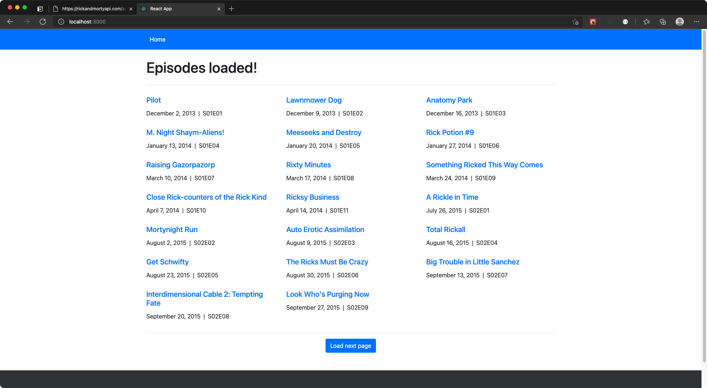
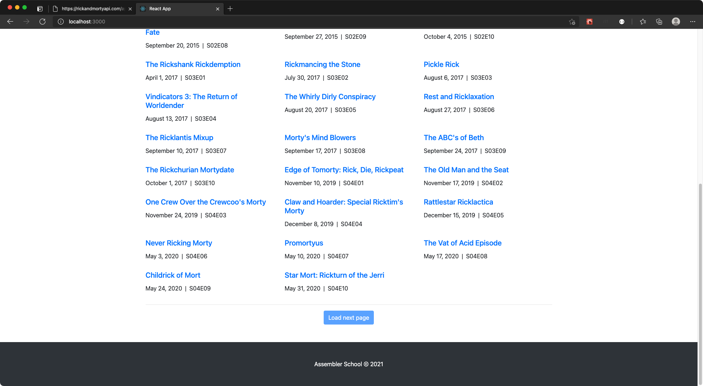
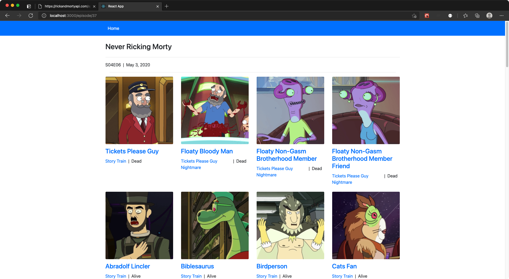
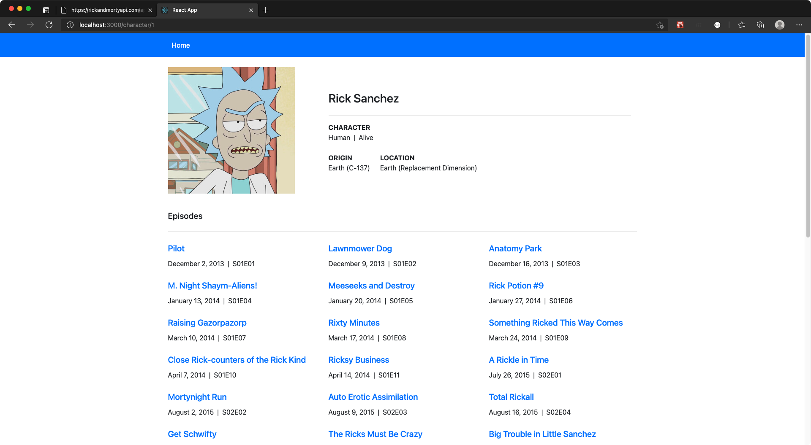
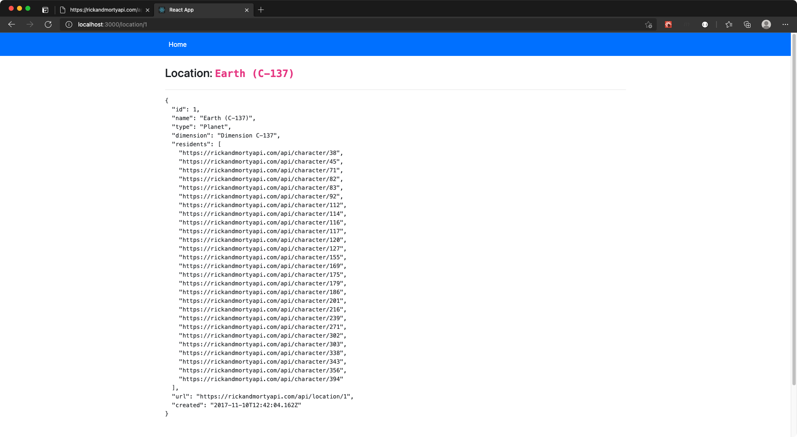

`#rick-morty-api` `#react-js` `#assembler-school`
`#master-in-software-engineering`

<!-- ALL-CONTRIBUTORS-BADGE:START - Do not remove or modify this section -->

[](#contributors-)

<!-- ALL-CONTRIBUTORS-BADGE:END -->

# Assembler School: React Rick & Morty

> In this project we will build a React.js SPA using the Rick & Morty API.

## Getting Started

These instructions will get you a copy of the project up and running on your
local machine for development and testing purposes.

See deployment for notes on how to deploy the project on a live system.

### The repository

First, you will need to `clone` or `fork` the repository into your Github
account:


```
$ git clone https://github.com/assembler-school/react-rick-morty.git
```

### Installing

First, you will need to install the dependencies with: `npm install`

```sh
$ npm install
```

### Running the tests

```
@TODO
```

### Linting and formatting

This project is setup using eslint and prettier for linting and code formatting.

At Assembler School, we recommend that all our students use them since they
provide great value with too much additional effort.

Furthermore, it also includes the `husky` and `lint-staged` packages that allow
you to run scripts on the files in the Git staging area before each commit or
before pushing changes to a remote repo.

## Deployment

This project is not intended to be deployed but you could use Netlify for it.

## Technologies used

- React.js
- react-router-dom
- axios

## Project requirements

This section details the **main requirements** of the project that you as a
student must take into account when delivering your solution.

A more **detailed description with all the requirements and steps** that you
need to complete in the project will be included in the **Google Docs version of
the requirements document.**

- You must develop this project using React.js
- You must use semantic HTML5 elements for all the contents of the application

## Project features

### Home page

Path: `/`



### Home page disabled pagination

Path: `/`



### Episode page

Path: `/episode/:episodeId`



### Character page

Path: `/character/:characterId`



### Location page

Path: `/location/:locationId`



## Project delivery

To deliver this project you must follow the steps indicated in the document:

- [Submitting a solution](https://www.notion.so/Submitting-a-solution-524dab1a71dd4b96903f26385e24cdb6)

## Resources

- [Reactjs.org docs](https://reactjs.org/)
- [React Router docs](https://reactrouter.com/web/api/Route)
- [axios docs](https://github.com/axios/axios)

## License

This project is licensed under the MIT License - see the [LICENSE](LICENSE) file
for details

## Contributors ✨

Thanks goes to these wonderful people
([emoji key](https://allcontributors.org/docs/en/emoji-key)):

<!-- ALL-CONTRIBUTORS-LIST:START - Do not remove or modify this section -->
<!-- prettier-ignore-start -->
<!-- markdownlint-disable -->
<table>
  <tr>
    <td align="center"><a href="http://www.danilucaci.com"><br /><sub><b>Dani Lucaci</b></sub></a><br /><a href="https://github.com/assembler-school/vanilla-js-project-template/commits?author=danilucaci" title="Code">💻</a> <a href="https://github.com/assembler-school/vanilla-js-project-template/commits?author=danilucaci" title="Documentation">📖</a> <a href="#example-danilucaci" title="Examples">💡</a> <a href="#tool-danilucaci" title="Tools">🔧</a></td>
  </tr>
</table>

<!-- markdownlint-restore -->
<!-- prettier-ignore-end -->

<!-- ALL-CONTRIBUTORS-LIST:END -->

This project follows the
[all-contributors](https://github.com/all-contributors/all-contributors)
specification. Contributions of any kind welcome!
